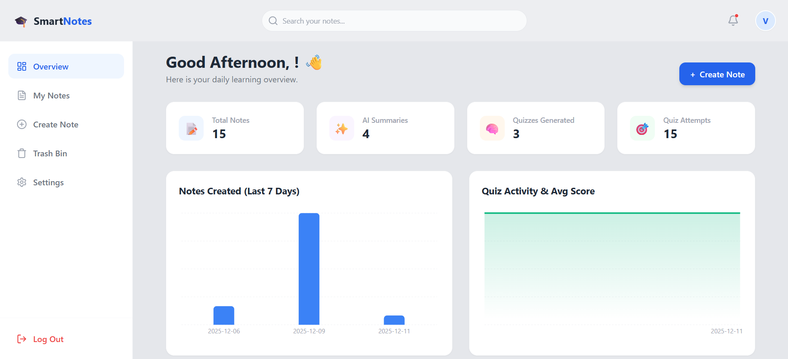
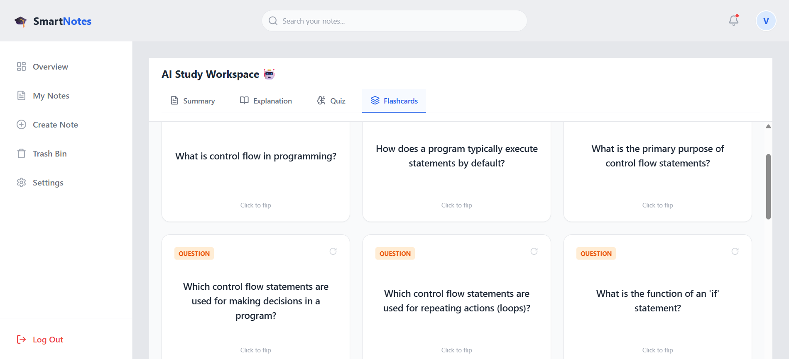
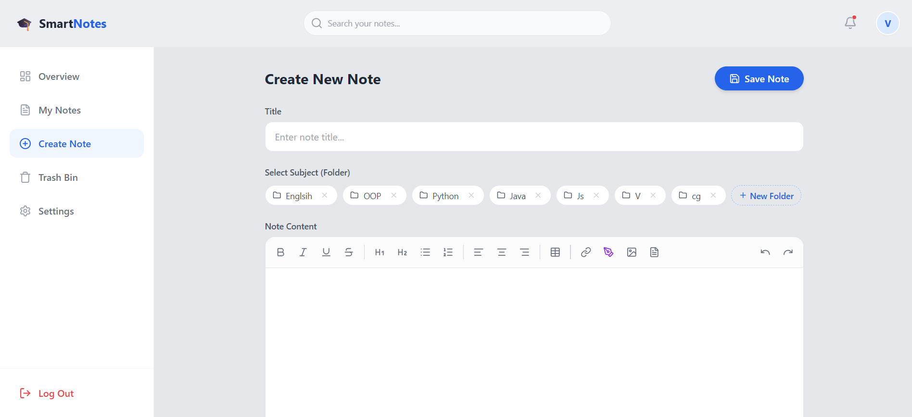
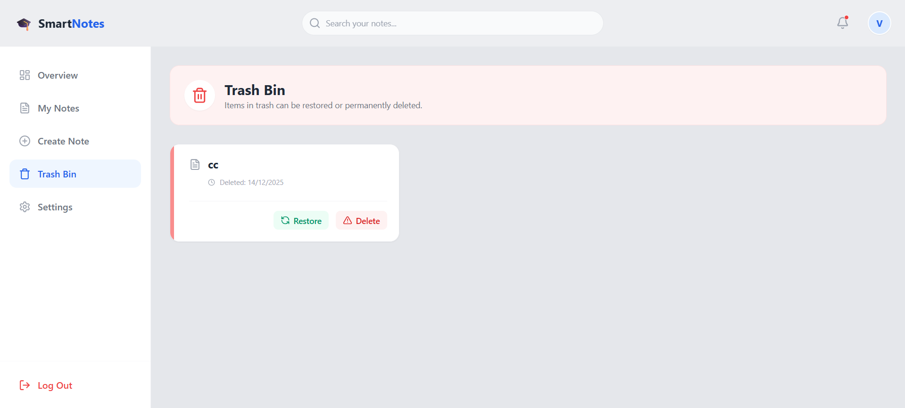

# 🎓 SmartNotes - AI-Powered Study Companion (Frontend)

**SmartNotes** is a modern, full-stack web application designed to revolutionize the way students learn. It combines a powerful rich-text editor with **Google Gemini AI** to automatically generate study materials such as summaries, quizzes, and flashcards directly from lecture notes.


---

## 🌟 Key Features

### 🔐 Authentication & User Management

* Secure Login & Signup using Email and Password (JWT-based authentication)
* Google OAuth for seamless one-click sign-in
* Profile management with profile image upload (Cloudinary integration)

### 📝 Advanced Note Editor (Tiptap)

* Rich text formatting: **Bold, Italic, Headings, Lists, Code Blocks, Quotes**
* Dynamic table creation and editing
* Multimedia support:

  * Image upload and embedding
  * PDF handling: Convert PDF pages into images and embed them inside notes
* Drawing tool using `react-sketch-canvas` to sketch diagrams and insert them as images

### 🤖 AI Workspace (Google Gemini 1.5 Flash)

* AI-generated summaries for long lecture notes
* Deep explanations for complex topics
* Auto-generated MCQ quizzes with instant scoring and feedback
* Flashcards generated by AI with interactive 3D flip animations

### 📂 Organization & Productivity

* Dashboard with study analytics (total notes, quiz performance)
* Subject-based folders for better organization
* Global real-time note search
* Trash bin with restore and permanent delete options

### 🎨 UI / UX

* Fully responsive design (Desktop & Mobile)
* Light and Dark theme support
* Modern UI built with Tailwind CSS and Lucide icons
* Toast notifications using `react-hot-toast`

---

## 🛠️ Tech Stack

| Category       | Technology           |
| -------------- | -------------------- |
| Framework      | React + Vite         |
| Language       | TypeScript           |
| Styling        | Tailwind CSS         |
| Icons          | Lucide React         |
| Editor         | Tiptap               |
| Drawing        | React Sketch Canvas  |
| Charts         | Recharts             |
| Routing        | React Router DOM     |
| API Client     | Axios                |
| Authentication | React OAuth (Google) |

---

## 🚀 Getting Started

### Prerequisites

* Node.js (v16 or higher)
* npm or yarn

### 1. Clone the Repository

```bash
git clone [https://github.com/your-username/smart-note-platform.git](https://github.com/Visun517/smart-note-platform-fe.git)
cd smart-note-platform/front-end
```

### 2. Install Dependencies

```bash
npm install
```

### 3. Configure Environment Variables

Create a `.env` file in the root of the `front-end` directory:

```env
VITE_GOOGLE_CLIENT_ID=your_google_client_id_here
VITE_API_BASE_URL=http://localhost:5000/api/v1
```

### 4. Run the Development Server

```bash
npm run dev
```

The application will run at:

```
http://localhost:5173
```

---

## 📂 Project Structure

```bash
src/
├── assets/          # Static images and global styles
├── components/      # Reusable UI components
├── Context/         # Auth & Theme contexts
├── layout/          # Main application layout
├── pages/           # Page-level components
├── services/        # Axios API services
├── utils/           # Utility helpers (PDF conversion, etc.)
└── App.tsx          # Application routing
```

---

## 📸 Screenshots

### Dashboard & Statistics



### AI Flashcards



### Rich Text Editor



### Trash Bin



> Place all screenshots inside the `public` folder.

---

## 🤝 Contributing

Contributions are welcome.

1. Fork the repository
2. Create a new branch: `git checkout -b feature/YourFeature`
3. Commit your changes: `git commit -m "Add new feature"`
4. Push to the branch: `git push origin feature/YourFeature`
5. Open a Pull Request

---

Built with dedication for students 🚀
